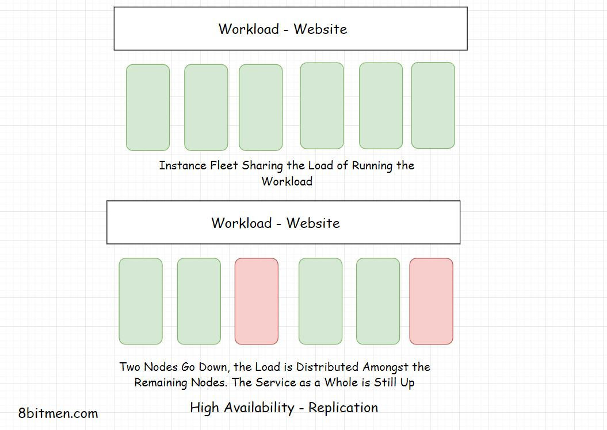

# High Availability

## What is High Availability

High availability is the ability of a system to stay online despite having failures at the infrastructural level in real-time.  High availability ensures the uptime of the service is much more than the normal time. It improves the reliability of the system, ensures minimum downtime. It is also known as HA

## Importance of HA

High availablility will not impact businesses if some applications like social media applications go down for a bit and then bounce back. But critical systems require like aircraft systems, spacecrafts, hospital servers or finance market systems just can't afford to go down and High Availability is must in such systems.

Either way, no service likes to go down, critical or not. To meet high availability, systems are designed to be fault tolerant, their components are made redundant.

## What is Fault Tolerance?

Fault Tolerance is the ability of the system to stay up despite taking hits. A fault-tolerant system is equipped to handle faults. In a fault tolerant system, out of all the nodes, services running in some of them go offine and bounce back all the time. In case of internal failure, system could work at a reduced level bi it will not go down entirely.

A very basic example of a system being fault is a social media ap. In case of backend failure, a few services like image upload, post likes, etc. may stop but the application will still be up. This approach is technically known as *Fail Soft*.

### Designing Highly Available Fault Tolerant Service - Architecture

To achieve high availability at application level, the entire massive service is architecturally broken down into smaller loosely coupled services called the micro-sevices.

There are many upsides of splitting a big monolith into several microservices, as it provides:

- Easier management
- Easier development
- Ease of adding new features
- Ease of maintenance
- High availability

Each microservice takes onus of running different features of an application. So even if a few services go sown, the application is still up.

## Redundancy

Redundancy is duplicating the components or instancs and keeping them on standby to takeover in case the active instances go down. It's the fail safe, backup mechanism.

This approach is known as *Active-Passive HA mode* An initial set of nodes are active and a set of redundant nodes are passive, on standby. Active nodes get replaced by passive nodes in case of failures.

## Replication

Replication means having a number of similar nodes running the workload together. There are no standby or passive instances. When a single or a few nodes go down, the remaining nodes bear the load.

This approach is also known as *Active-Active High Availability mode*. I this mode, all components of the system are active at any  point in time.

## High Availability Clustering

A High Availability cluster also known as a Fail-Over cluster contains a set of nodes running in conjunction with each other that ensures high availability of the service.

The nodeds in the cluster are connected by a private network called the Heartbeat network that continuously monitors the health and the status of each node in the cluster. A single state across all the nodes in a cluster is achieved with the help of a shared distributed memory and a distributed co-ordination service like the *Zookeeper*.

HA clusters use sevaral techniques such as *Disk morroring/RAID Redundant Array of Independent Disks*, redundant network connections, redundant electrical pwer, etc. to ensure High Availability. If any primary component goes down, backup network takes over. This ensures minimum downtime and continual service.